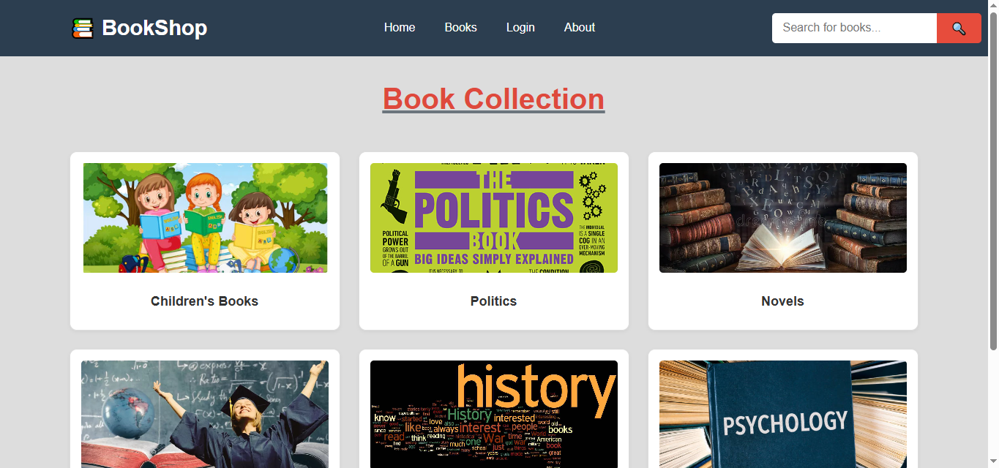
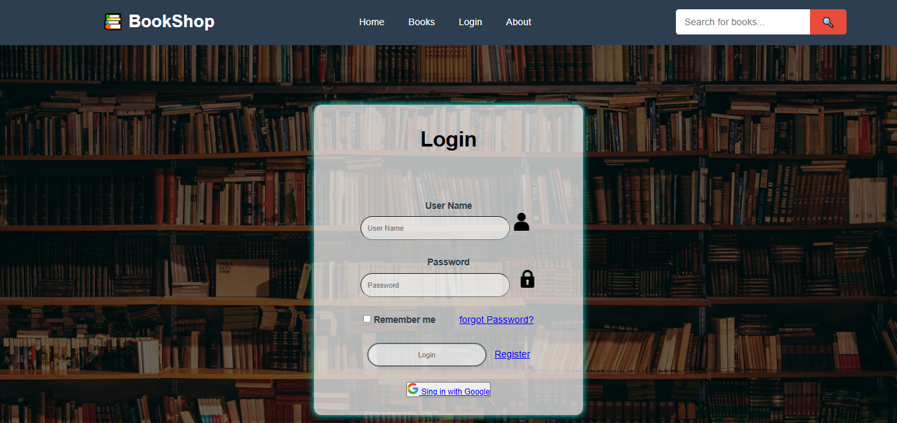
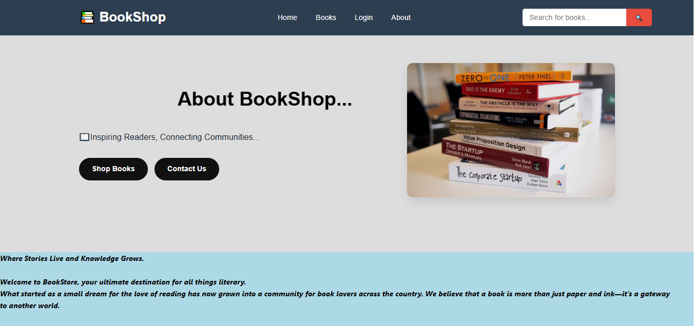
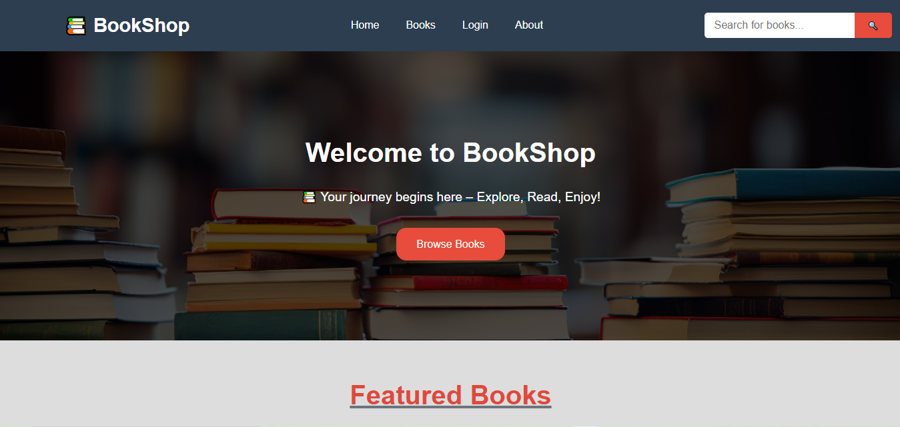

# 📚 Bookshop Web App

> A responsive online bookshop website built with HTML, CSS and JavaScript.


---

## 🌐 Live Demo

🔗 [View Website](https://thisura-maleesha.github.io/bookshop-web-app/)

---

## 📸 Screenshots

### 🏠 Home Page


### 📖 Book Collection


### 🔐 Login Page


### ℹ️ About Page


---

## 🛠️ Built With

| Technology | Usage |
|---|---|
| HTML5 | Page structure & content |
| CSS3 | Styling & responsive layout |
| JavaScript | Interactivity & dynamic features |

---

## ✨ Features

- 🏠 **Home Page** — Hero section with Browse Books button & Featured Books
- 📚 **Book Collection** — Browse books by category (Children's, Politics, Novels, History, Psychology & more)
- 🔐 **Login Page** — User login with Remember Me, Forgot Password & Google Sign-in
- ℹ️ **About Page** — BookShop story and contact options
- 🔍 **Search Bar** — Search for books across the site
- 📱 **Responsive Design** — Works on all screen sizes

---

## 📁 Project Structure

```
bookshop-web-app/
├── index.html
├── Bookstore.css
├── categories.html
├── login.html
├── about.html
└── *.jpg  (book cover images)
```

---

## 🚀 Getting Started

1. Clone the repository
```bash
git clone https://github.com/thisura-maleesha/bookshop-web-app.git
```

2. Open `index.html` in your browser

---

## 👨‍💻 Author

**Thisura Maleesha**
- GitHub: [@thisura-maleesha](https://github.com/thisura-maleesha)

---

<div align="center">
  <sub>Made with ❤️ by Thisura Maleesha · Sri Lanka 🇱🇰</sub>
</div>
